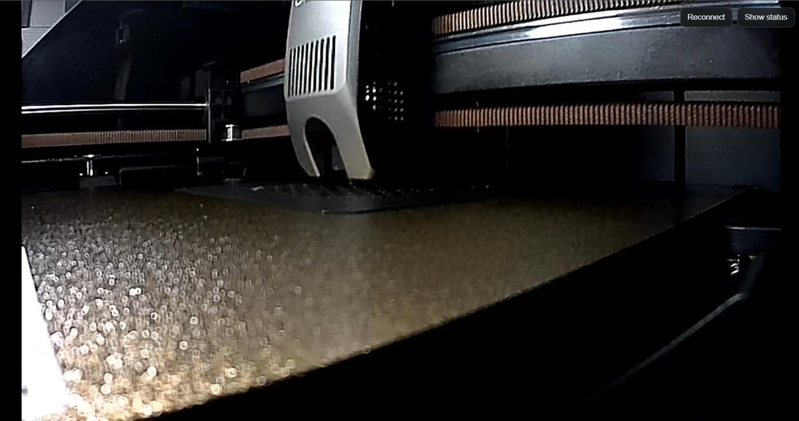
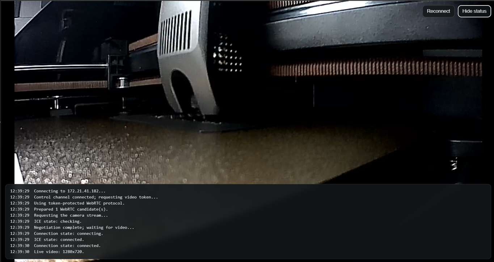

# Creality-K2-Camera-Fix

This fix was developed to restore the ability to view the camera feed from another device on the local network.
Previously, it was possible to access port 8000 and view the camera via a web browser.
According to users, this functionality broke in a firmware version—though I do not know which one.
In my case, the feature was already broken when I bought the printer.
So, I decided to recreate it to make it usable again.
I am sharing the project so others can adapt it to their needs.

Good luck!

---

An unofficial Fluidd camera page for Creality K2-series printers whose integrated camera is no longer available through the former port `8000` web page.

The project consists of a single dependency-free file, [`camera.html`](camera.html), designed to be served by the printer's existing Fluidd nginx server. It connects automatically by deriving the printer address from the page URL.

## Features

- Direct, low-latency H.264 video over WebRTC.
- Supports current token-protected camera firmware.
- Retains compatibility with the legacy port `8000` signaling endpoint. (Theoretical, not validated, although it is no longer relevant.)
- Automatically uses the Fluidd host address; there is no IP configuration.
- Collapsible diagnostics panel and manual reconnect control.
- Allows multiple simultaneous connections.
- No cloud services, proxy, external libraries, analytics, or telemetry.

## Requirements

- A compatible Creality printer running Fluidd on port `4408`.
- Root/SSH access to install the page in Fluidd's web directory.
- A modern browser with WebRTC and H.264 support.
- The viewing device must be able to reach the printer on the local network.

This project has been tested with a token-enabled Creality K2-series firmware. Other models and firmware versions may behave differently.

## Installation

Enable root/SSH access from the printer settings if it is not already enabled, then copy `camera.html` to Fluidd's document root.

### Windows PowerShell

Run this command from the project directory, replacing the example address:

```powershell
$PrinterIp = "192.168.1.100"
scp .\camera.html "root@${PrinterIp}:/usr/share/fluidd/camera.html"
```

### Linux or macOS

```bash
scp ./camera.html root@192.168.1.100:/usr/share/fluidd/camera.html
```

Enter the printer's root password when prompted. nginx does not need to be restarted.

Open the installed viewer at:

```text
http://PRINTER_IP:4408/camera.html
```

The viewer reads `location.hostname` and connects to that printer immediately. It intentionally has no manual IP field and is not intended to run from `file://`.

> [!NOTE]
> A firmware update or factory reset may remove `camera.html`. Reinstall the file if that happens.

## How it works

When the page opens, it reads the printer address from `location.hostname` and starts the connection automatically:

1. It opens the printer's WebSocket control channel on port `9999` and requests a temporary video token.
2. It creates an H.264 WebRTC offer in the browser.
3. It sends the offer and token to the printer's local WebRTC signaling endpoint.
4. It applies the returned answer and plays the incoming video track.

Port `9999` carries control and telemetry data, not the video itself. The video travels directly between the printer and browser over WebRTC. On older firmware, the viewer automatically uses the legacy signaling endpoint on port `8000`.

Modern browsers replace local IP addresses in WebRTC offers with private mDNS names. Some Creality firmware cannot parse those names. The viewer substitutes a reserved numeric address, allowing ICE to discover the real LAN route automatically.

## Controls

- **Reconnect** closes the current WebRTC and WebSocket sessions and starts a new connection.
- **Show status** opens the diagnostics log. The panel is collapsed by default and opens automatically when an error occurs.

## Troubleshooting

### Fluidd opens instead of the camera page

nginx returns the Fluidd application when a requested static file is missing. Confirm that the file exists at exactly:

```text
/usr/share/fluidd/camera.html
```

Then force-refresh the browser.

### The camera does not connect

- Confirm that the viewer is being opened from the printer at `http://PRINTER_IP:4408/camera.html`.
- Confirm that the viewing device is on the same LAN as the printer.
- Ensure firewall or Wi-Fi client-isolation rules are not blocking ports `80`, `4408`, or `9999`.
- Select **Show status** for the connection error, then try **Reconnect**.
- Reload the page after rebooting the printer.

### H.264 is unavailable

Use an up-to-date version of Chrome, Edge, Firefox, or Safari with WebRTC H.264 decoding enabled.

## Updating

Download the new `camera.html` and repeat the installation command. Replacing the file is sufficient; no service restart is required.

## Security

This viewer is intended for trusted local networks. Do not expose the printer's HTTP, Fluidd, or WebSocket ports directly to the public internet. Use a properly configured VPN for remote access instead of router port forwarding.

Enabling root access grants full control over the printer. Only copy files and run commands that you understand.

## Screenshots

Viewer:


Viewer + Status


## Disclaimer

This is an unofficial community project and is not affiliated with or endorsed by Creality. It relies on undocumented local interfaces that may change in future firmware releases. Use it at your own risk.

